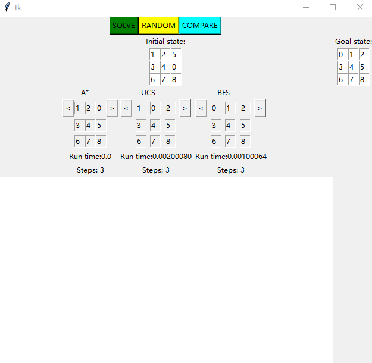

Members of group 3:
DING Xiangyuan 4014815
XUE Yayun 4024860
ZHUMANAZAROV Magzhan 4165121

File list:
phase_2.py

File description:
This is a python program written to solve the 8-puzzle with 3 searching algorithms. It used the tkinter to make the GUI. User can input a puzzle or generate 
a random puzzle and the program will automatically process it to the user's goal state. 

Method of complication:
Python 3.8

Method of execution:
Python

known bugs:
UCS not able to solve the randomly generated puzzles. So we added a limit of at most 5000 searchings. When it reached 5000, it will report: UCS failed.
GUI sometimes crashes when the program is running 

